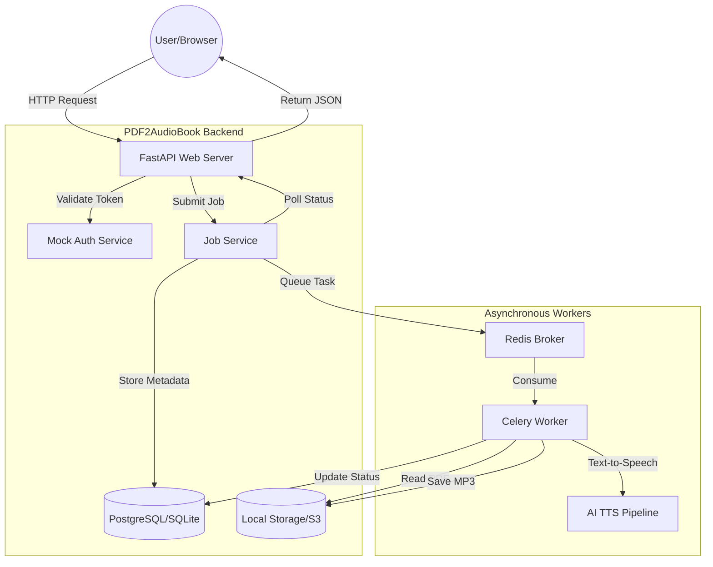

# PDF-to-Audiobook Backend Documentation

## 🏗 System Architecture

The PDF-to-audiobook backend is built using a modern, distributed architecture designed for reliability and scalability. It leverages asynchronous task processing to handle the computationally intensive PDF-to-speech conversion.



## 🚀 Core Components

### 1. Web Framework: FastAPI
- **Main Entry Point**: `backend/main.py`
- **Responsibilities**:
    - Defining RESTful endpoints.
    - Handling CORS and middleware.
    - Integration with the database and background workers.
    - Providing Swagger UI documentation (at `/docs`).

### 2. Background Processing: Celery + Redis
- **Broker**: Redis (`192.168.0.225:6379`).
- **Worker Logic**: Located in `worker/tasks.py`.
- **Purpose**: Decouples long-running conversions from the web server, allowing for a responsive UI while processing happens in the background.

### 3. AI Conversion Pipeline
- **Orchestrator**: `PipelineService` (managed via `worker/tasks.py`).
- **Features**:
    - **OCR**: Extracts text from standard and scanned PDFs.
    - **Summarization**: Uses LLMs (OpenAI) to generate concise summaries.
    - **TTS**: Converts text to natural-sounding speech (OpenAI/Google).

## 📡 API Endpoints (v1)

| Method | Endpoint | Description |
| :--- | :--- | :--- |
| `POST` | `/api/v1/jobs/` | Submit a PDF for processing. |
| `GET` | `/api/v1/jobs/` | List all jobs for the current user. |
| `GET` | `/api/v1/jobs/{id}` | Get status, progress, and download link for a job. |
| `DELETE` | `/api/v1/jobs/{id}` | Permanently delete a job and its files. |
| `GET` | `/api/v1/users/me` | Retrieve the mock "Base User" profile. |

## 🛠 Operation & Troubleshooting

### Local Development Setup
1. **Virtual Environment**: Use the provided `.venv`.
   ```bash
   # Activate (Linux)
   source .venv/bin/activate
   ```
2. **Start Backend**:
   ```bash
   cd backend
   uvicorn main:app --reload --port 8000
   ```
3. **Start Worker**:
   ```bash
   celery -A worker.celery_app worker --loglevel=info
   ```

### Common Issues
- **"Port already in use"**: The web server didn't shut down properly. Run:
  `fuser -k 8000/tcp`
- **Worker not picking up tasks**: Check if the Redis broker is reachable. The worker logs will show "Connecting to Celery Broker".
- **Database Errors**: Ensure `test.db` exists or is properly initialized via migrations.

## 📈 Metric Tracking
All jobs track several performance metrics:
- `estimated_cost`: Cost calculation based on characters and tokens.
- `chars_processed`: Total character count extracted from the PDF.
- `tokens_used`: Total LLM tokens consumed for summaries/explanations.
